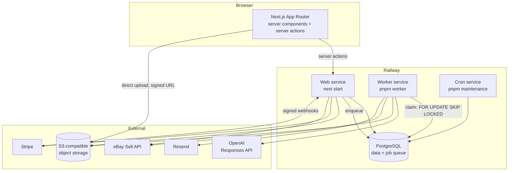
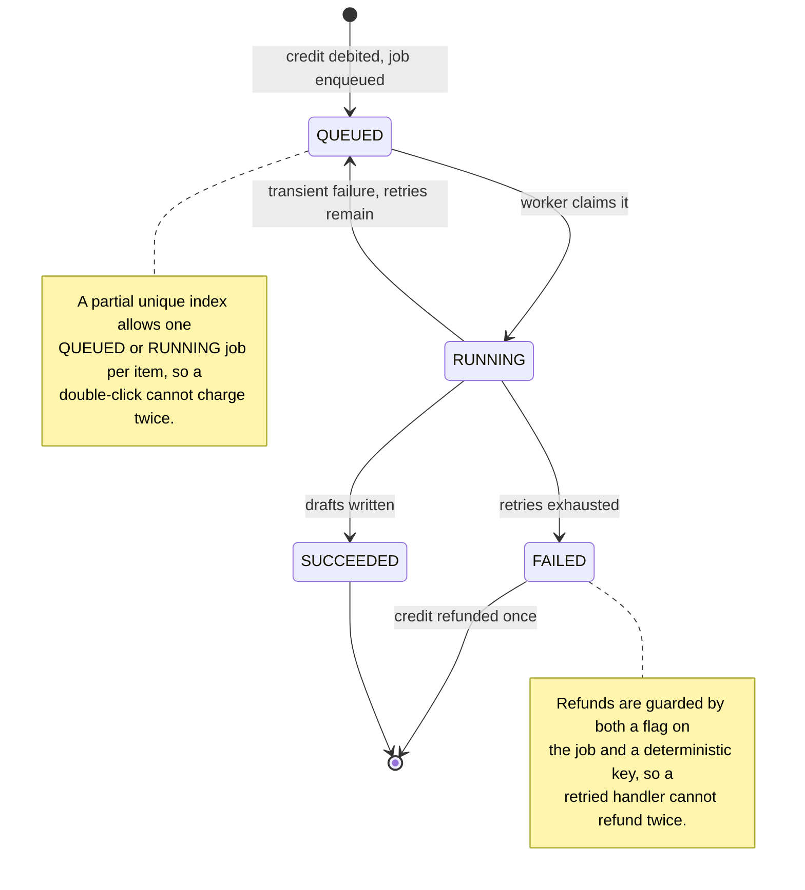
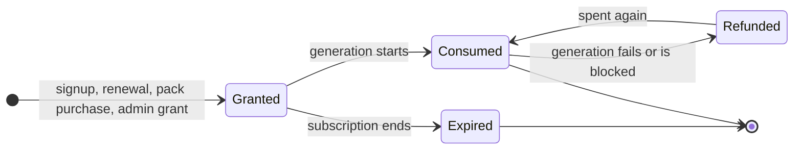
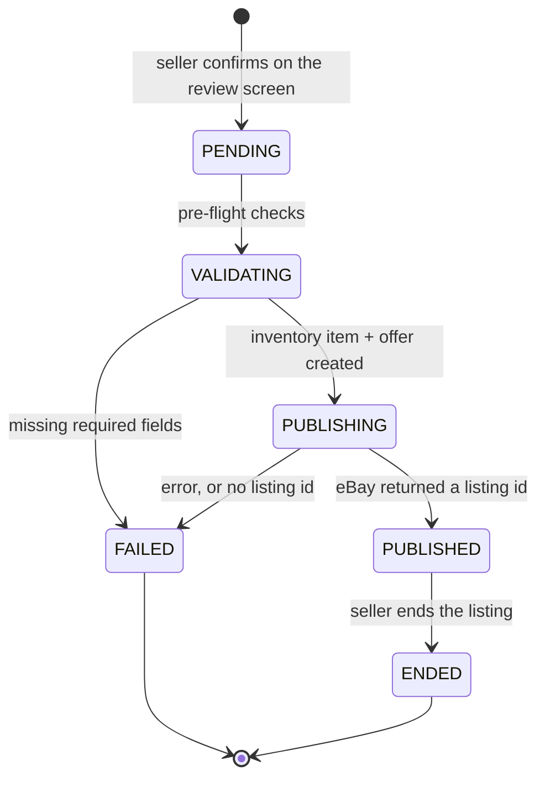

# Architecture

## Shape of the system



Two processes, one image. The web service serves requests and enqueues work;
the worker claims and runs it. They share a database and nothing else, so
either can be restarted or scaled without coordinating with the other.

## Decisions worth explaining

### PostgreSQL is the queue

Jobs live in a `job` table and are claimed with a single statement:

```sql
UPDATE "job" SET status = 'RUNNING', ...
WHERE id IN (
  SELECT id FROM "job"
  WHERE status = 'QUEUED' AND "runAt" <= NOW()
  ORDER BY priority ASC, "runAt" ASC
  FOR UPDATE SKIP LOCKED
  LIMIT $1
)
RETURNING *
```

`FOR UPDATE SKIP LOCKED` means two workers never claim the same job, and
because claiming is one statement there is no window in which a crash leaves a
job both unclaimed and unavailable. A crash *after* the claim is recovered by
`reclaimStalledJobs`, which returns anything locked for too long.

This is one moving part instead of two. A separate Redis would add an operating
cost, a second failure mode, and a second thing to back up, for a workload of a
few jobs per user per day.

### The credit ledger is the source of truth

`credit_ledger` is append-only. A mistake is corrected with a compensating
entry, never by editing or deleting history. The `workspace.monthlyCredits` and
`purchasedCredits` columns are a cache of it, updated inside the same
transaction as the entry that moves them, under `SELECT ... FOR UPDATE` on the
workspace row.

Every write carries a deterministic `idempotencyKey` with a unique index behind
it. A retried webhook, a double-clicked button and a job that runs twice all
converge on one entry rather than charging twice. Monthly credits are always
spent before purchased ones, so a customer never loses the credits they paid
for while a renewing allowance sits unused.

### Marketplace capability is data, not marketing

Every adapter declares what it can actually do, and the interface is derived
from that declaration. eBay has an approved public API, so it can publish. The
others do not, so they cannot — the product says so and offers an export
instead of a button that would fail.

The check is enforced on the server: `publishToMarketplaceAction` re-reads the
adapter's capabilities and refuses, so a hand-crafted request gets no further
than the UI would have.

### Encryption at rest for marketplace tokens

OAuth access and refresh tokens are encrypted with AES-256-GCM under
`TOKEN_ENCRYPTION_KEY` before they are stored, and decrypted only in the
process that is about to make a call. A database dump on its own does not give
anyone access to a customer's eBay account.

Token refresh is serialised per connection with a **transaction-scoped**
PostgreSQL advisory lock. A session-scoped lock would be wrong here: Prisma
talks to PostgreSQL through a pool, so a session lock can be taken on one
connection and released on another — the release silently fails, and the lock
then survives for the life of that pooled connection, deadlocking every later
refresh.

### Prompts are versioned, published versions are immutable

A `PromptVersion` that has been published is never edited. Changing a prompt
creates a new version, and every AI job records which version produced it. When
output quality changes you can tell whether the prompt moved, and roll back.

## State machines

### An AI job



A blocked item — one the safety check flags as prohibited — is a `SUCCEEDED`
job that produced no listing, and is refunded on the same path.

### Credits



Every transition is one row in the append-only ledger. Cancelling a
subscription expires the monthly bucket *through the ledger* and leaves
purchased credits untouched — the customer paid for those separately.

### Publishing to a marketplace



The important edge is `PUBLISHING → FAILED` on a response that carries no
listing id. eBay can return a 200 with warnings and no listing, and treating
that as success would tell a seller their item is live when it is not. Success
is only ever recorded against an actual listing id.

Each attempt is keyed by a unique `idempotencyKey`, so a retry after a network
timeout resumes the existing attempt rather than creating a second listing for
one physical item.

## Where the code lives

```
src/app/                  routes: (marketing), (auth), app/, admin/, api/
src/components/           design system and feature components
src/lib/                  env, db, auth, crypto, logger, rate limiting
src/server/               all business logic; never imported by a client component
  ├── credits.ts          the ledger
  ├── items/              item lifecycle and generation entry
  ├── listings/           AI generation pipeline
  ├── pricing/            price engine
  ├── marketplace/        adapter contract, eBay, export-only adapters
  ├── billing/            Stripe
  ├── jobs/               queue, handlers, worker runtime, maintenance
  ├── exports/            text, JSON, CSV, photo bundles
  └── admin/              admin actions, stats, health
prisma/                   schema, migrations, seed, fixtures
scripts/                  worker, maintenance, super-admin bootstrap
tests/unit/               pure logic
tests/integration/        against a real PostgreSQL database
tests/e2e/                Playwright, against a production build
```

The boundary that matters: anything under `src/server/` performs its own
authorisation. Hiding a control in the interface is a courtesy; the server
check is the actual protection, and the tests call these functions directly —
exactly as a crafted request would — to prove it.
